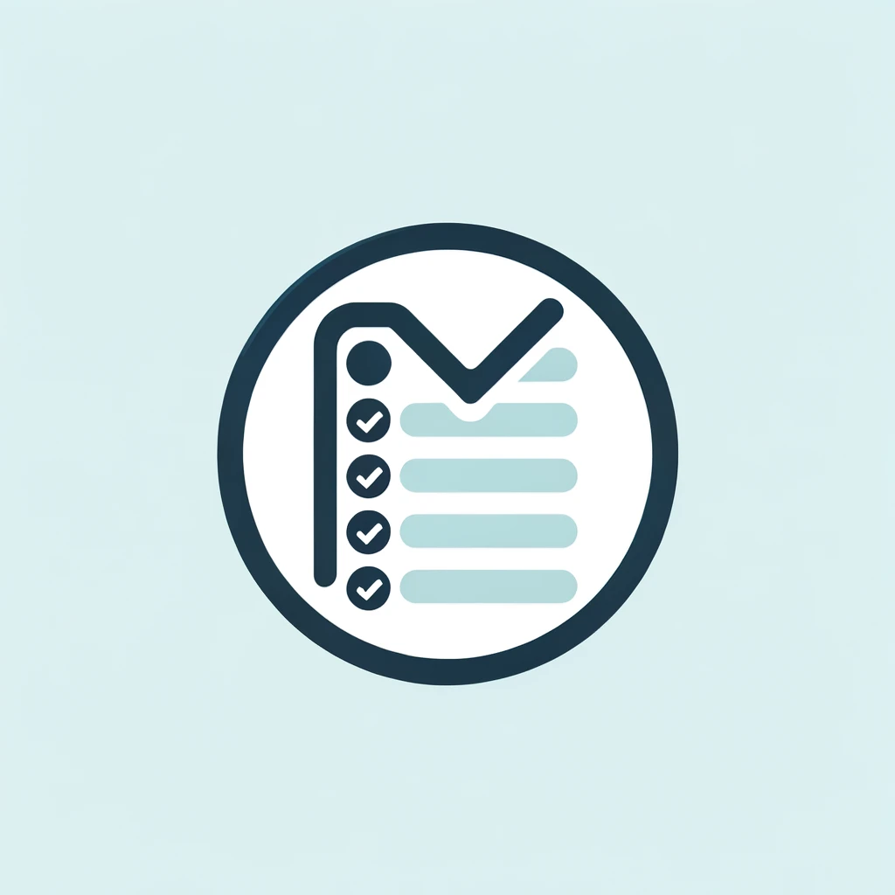

# My Todo App

## Introduction

**My Todo App** is a productivity tool designed to help individuals manage their daily tasks and enhance their efficiency. Built with simplicity in mind, our app allows users to quickly add, view, and complete tasks with minimal effort, ensuring that productivity is maximized without overwhelming the user.

## Features

- **Easy Task Addition:** Add tasks to your to-do list with a simple input field. Just type and hit enter - the app takes care of the rest.
- **Real-Time Updates:** Your to-do list updates in real-time as you add or check off tasks, providing you with instant feedback on your progress.
- **Persistent Storage:** Tasks are stored persistently, so your to-do list is always there when you return to the app, ready for your next productive session.
- **Minimalist Design:** A clean and intuitive interface that focuses on usability and simplicity, reducing cognitive load and enhancing focus.

## Getting Started

To get started with **My Todo App**, follow these simple steps:

1. Clone the repository:
git clone https://github.com/wolflergf/web_app_todo.git

2. Install the required dependencies:
pip install -r requirements.txt

3. Run the app:
streamlit run web.py

## Contribution

We welcome contributions to **My Todo App**! If you have suggestions for improvements or new features, feel free to fork the repository, make your changes, and submit a pull request. We're always looking to make our app better for everyone.

## License

**My Todo App** is open-source software licensed under the MIT license. See the LICENSE file for more details.

---

Built with ❤️ by [Wolfler](https://github.com/wolflergf)